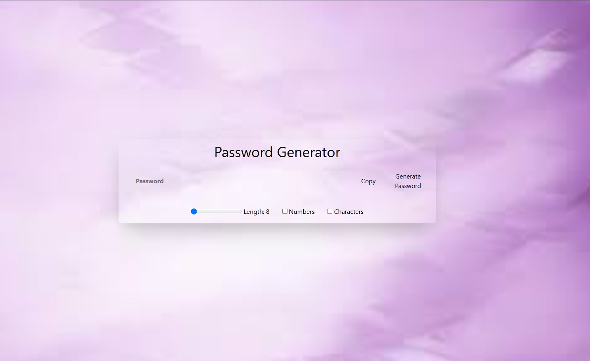
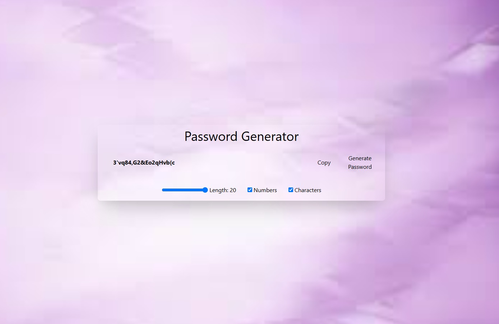

# 🔐 Password Generator

<div align="center">


A modern password generator built with **React**, **Vite**, and **Tailwind CSS** that creates strong, customizable, and secure passwords instantly.

</div>

---

# 📖 Overview

This application allows users to generate secure passwords by selecting the desired length and character types. It provides an intuitive interface with instant password generation and one-click copy functionality.

---

# ✨ Features

- 🔑 Generate secure random passwords
- 📏 Adjustable password length
- 🔠 Include uppercase letters
- 🔡 Include lowercase letters
- 🔢 Include numbers
- 🔣 Include special characters
- 📋 Copy password to clipboard
- ⚡ Instant password generation
- 📱 Responsive design

---

# 🛠 Tech Stack

- React 19
- Vite
- JavaScript (ES6+)
- Tailwind CSS

---

# 📸 Screenshots

## Home



---

## Generated Password



---

# 📂 Project Structure

```text
Password-Generator/
│
├── Screenshots/
├── src/
├── public/
├── package.json
├── vite.config.js
└── README.md
```

---

# 🚀 Installation

Clone the repository

```bash
git clone https://github.com/VijayalaxmiSankpal/Password-Generator.git
```

Navigate to the project

```bash
cd Password-Generator
```

Install dependencies

```bash
npm install
```

Start the development server

```bash
npm run dev
```

---

# 💡 Future Improvements

- Password strength meter
- Password history
- Theme toggle
- Pronounceable passwords
- Export password feature

---

# 👩‍💻 Author

**Vijayalaxmi Sankpal**

📧 vijayalaxmisankpal@gmail.com

💼 LinkedIn  
https://www.linkedin.com/in/vijayalaxmi-sankpal-b99b4a25b

💻 GitHub  
https://github.com/VijayalaxmiSankpal

---

# ⭐ Support

If you found this project helpful, consider giving it a ⭐ on GitHub.

---

<div align="center">

**Built with React & Tailwind CSS 🚀**

</div>